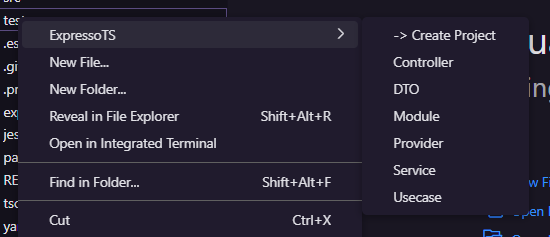
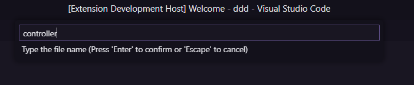

# Expresso TS VSCODE Extension

## Creating a Expresso TS project

Open the command terminal:

```
Ctrl + Shift + p
```

Enter the command:

```
Create Project
```


## Creating New Resource

Right-click on the directory that has an Expresso TS project and select one of the options to generate a new resource.



Enter the name of the resource name and press enter, the extension will generate the selected resource in the directory.




List of available resources:
- Create Project
- Controller
- DTO
- Module
- Provider
- Service
- Usecase

## List of availables Snippets:

| Command | Action |
| --- | --- |
| todo | TODO Comments |
| bug | Bug Comments |
| review | To Review Comments |
| reasearch | Research Comments |
| cl | console.log(); |
| if | Creates an if statement |
| else | Else statement |
| ifelse | Creates an if else statement |
| enum | Create a Enum Type |
| switch | Create a Switch statement |
| while | While loop |
| dowhile | Creates a do while loop |
| try | Creates a try catch block |
| class | Creates a basic class |
| ctor | Creates a constructor |
| regex | Regex cheat sheet |